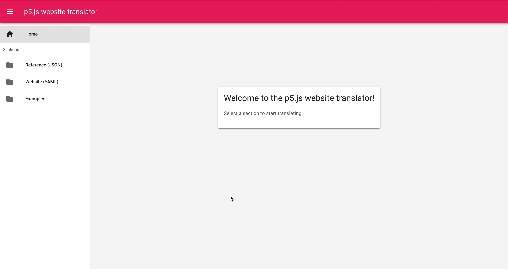
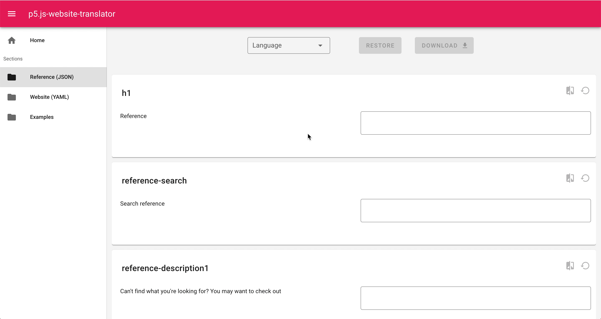
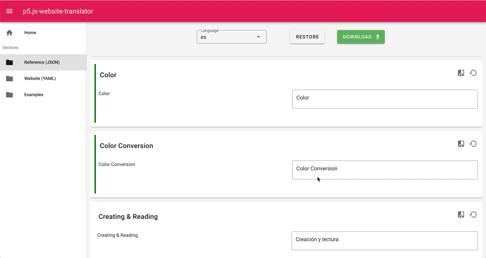
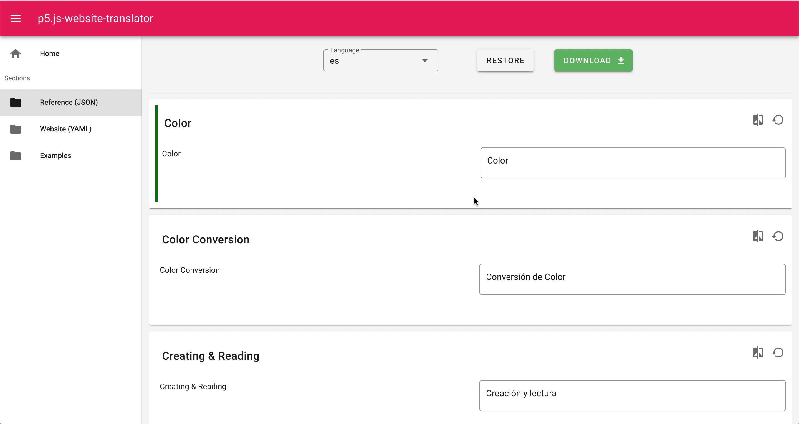

# p5.js-website-translator

Welcome!
The p5.js-website-translator is a platform designed to help contributors translating the p5.js website.

**How to use the p5.js-website-translator**:
1) Open the [p5.js-website-translator](https://processing.github.io/p5.js-website-translator).
  
2) Select the section of the p5.js website you want to translate.
  
3) Choose the language you want to translate the text in. 
  
  *(Currently, you can only edit the translation files that already exist in the p5.js-website repository. The feature to add new translations is coming soon!)*
4) Edit the text cards.
  
  *(The green highlight of the "Color Conversion" text card signals that the text in the card is not translated. As you can see, it disappears once the translation is edited.)*
5) Download the edited file.
  
6) Submit a Pull Request with the edited file to the p5.js-website repository.

### Get Involved 
If you discover a bug or have an idea for a new feature you'd like to add, please submit an issue. If you would like to work on an existing issue, feel free to create a Pull Request. Any help or suggestion is more than welcome!

### Build Setup

```bash
# install dependencies
$ npm install

# serve with hot reload at localhost:3000
$ npm run dev

# build for production and launch server
$ npm run build
$ npm run start

# generate static project
$ npm run generate
```

For detailed explanation on how things work, check out [Nuxt.js docs](https://nuxtjs.org).

### Code of Conduct
All contributors to the p5.js-website-translator are expected to follow the [Code of Conduct](https://github.com/processing/p5.js/blob/main/CODE_OF_CONDUCT.md). We strive to create a friendly and safe community!